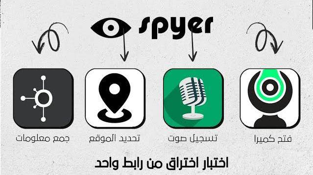

# spyer
<h4 align="center">Hacking a camera, determining the location, recording a microphone, bringing information, and all this with just a link. </h4>
<h1 align="center">
   
  

</h1>
The spy project built on the ruins of the Storm-Breaker tool performs the same process, but in an easier way and includes all types of devices
### Features:

- Obtain Device Information Without Any Permission !
- Access Location [SMARTPHONES] 
- Access Webcam 
- Access Microphone

#run tool 
~~~
[1]install project
[2]login in replit.com
[3]Upload project files to your site
~~~
#How to use
https://www.youtube.com/playlist?list=PLBMtDfEzq-I-acv2p90NyWN6bluReQrPC
